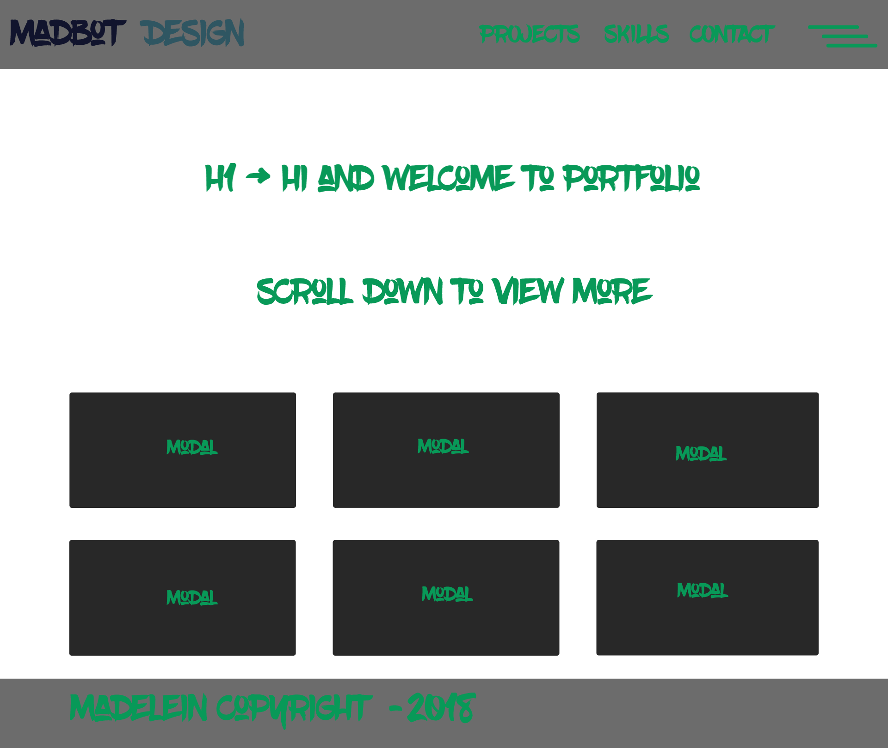
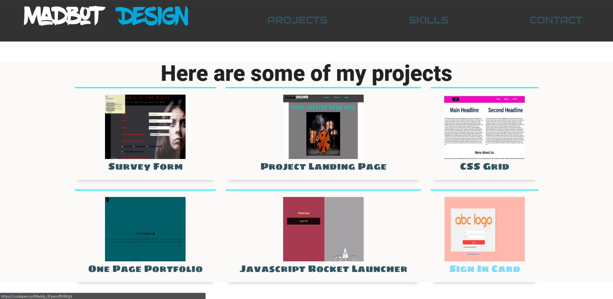

# FCC (FreeCodeCamp) - Personal Portfolio Page
---

## Project Objective
Build an app that is *functionally* similar to this: https://codepen.io/freeCodeCamp/full/zNBOYG.

***

## Requirements
#### Requirement Number One:
My portfolio should have a ```welcome section``` with an ```id of welcome-section```. The welcome section should have an ```h1``` element that contains text.

#### Requirement Number Two: 
My portfolio should have a ```projects section``` with an ```id of projects```. The projects section should contain at least one element with a ```class of project-tile```, one ```a element link``` to a project.

#### Requirement Number Three: 
My portfolio should have a ```navbar``` with an ```id of navbar```. The navbar should contain at least one ```a element link``` that I can click on to navigate to different sections of the page. The navbar should always be at the top of the viewport.

#### Requirement Number Four: 
My portfolio should have a link with an ```id of profile-link```, which opens my GitHub or FCC profile in a new tab. And should have at least one media query.The height of the welcome section should be equal to the height of the viewport.

***

## Project Install Requirements

- **NodeJS - [NodeJS](http://nodejs.org)** - Follow the prompts to install
- **Gulp - [GulpJS](https://gulpjs.com/)**
```
npm install -g gulp
```

***

## Start Project
Run the following command: 
```
npm install
```

***

## How to use the project
Open your terminal and type gulp. This will run the ```gulpfile``` and ensure that all the compilers are working and watching for any changes taking place.

Here are other commands that you can run.

* **default**: Compile and watch for changes
* **scripts**: Compile the JavaScript files
* **sass**: Compile the Sass styles
* **images**: Copy the newer to the build folder
* **vendors**: Copy the vendors to the build folder
* **watch**: Watch for any changes on the each section

The `gulp` command is the best choice for you most likley.

***

## Project Starter Kit
Courtesy of: **Jesse Showalter** 
Go check out his [YouTube](https://www.youtube.com/watch?v=sr6jDeAoXCc&feature=youtu.be&list=PLrtjkLnNjGHu7QIc8jN7hZmuP6wMby2QZ) channel for more information and awesome content.

## Project Thumbnails:



